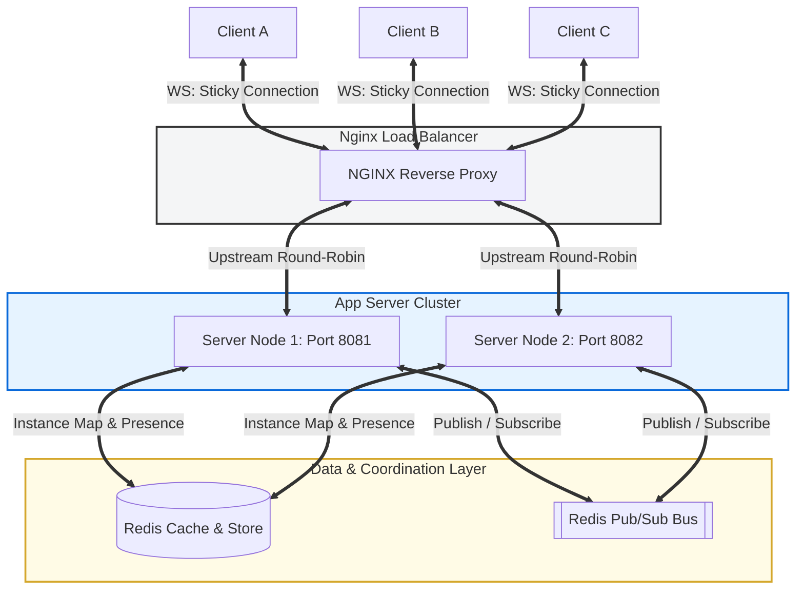

# 🪐 HAVEN Engine

A scalable, high-performance, custom-built 2D multiplayer game engine and interactive sandbox space. Built from scratch with an emphasis on engineering fundamentals, network synchronization, and scalable distributed systems.

Designed as an educational playground, HAVEN Engine demonstrates how to bridge the gap between low-level HTML5 canvas rendering, sub-frame physics interpolation, and horizontally scaled multiplayer architectures.

---

## 🏗️ System Architecture

HAVEN Engine scales from a single local development instance into a fully distributed cluster. Below is the architecture diagram depicting **Phase 6: Horizontal Redis Scaling**, where WebSocket connections are load-balanced across multiple nodes, with states unified via a Redis backbone.



---

## ⚡ Core Technical Systems & Deep Dives

### 1. Authoritative Physics & Bounding-Box Math
To completely prevent cheating (e.g. wall-clipping or speed hacking), the server is the absolute source of truth.
* **4-Corner Bounding Box Check:** Collision is calculated using a **12x12 pixel AABB** (Axis-Aligned Bounding Box) model. Both client and server run the identical verification checks.
* **Movement Verification:** When a key is pressed, the client requests a move. The server verifies each axis independently to allow sliding along walls.
  ```text
  Client Position (x, y) ─────► [ Is Solid? ]
                                    ├─── Top-Left Corner  (x, y)
                                    ├─── Top-Right Corner (x + 12, y)
                                    ├─── Btm-Left Corner  (x, y + 12)
                                    └─── Btm-Right Corner (x + 12, y + 12)
  ```

### 2. Lag Compensation: Prediction & Reconciliation
A raw server-authoritative model suffers from a laggy "rubber band" feel. HAVEN Engine implements advanced multiplayer synchronization patterns:
* **Client-Side Prediction:** When a local player presses a key, they move immediately on their own screen using local delta time (`dt`). The input is appended to a `PredictionBuffer` with an incrementing `sequence` identifier and transmitted to the server.
* **Server Reconciliation:** The server simulates the movement authoritatively, tracking the last processed `sequence` for that player. It transmits the true position back to the client along with the sequence ID. The client then discards all acknowledged frames and *re-plays* the remaining unacknowledged inputs on top of the server's authoritative position to calculate the correct updated position.
* **Entity Interpolation:** Remote entities are never predicted. Doing so leads to erratic movement. Instead, remote players' received positions are pushed into an `InterpolationBuffer` and rendered with a tiny buffer delay (~100ms), smoothly interpolating between historic states.

### 3. Multi-Instance Sandboxing
Players can create isolated 2D sandbox worlds on the fly.
* **Dynamic Code Generation:** Creating a room yields a unique, 6-character, uppercase alphanumeric code (e.g., `Z4H8KP`).
* **$O(1)$ Message Routing:** Inside `InstanceManager`, active players are tracked in a flat reverse-lookup map (`playerToInstance`). This ensures that incoming packets are routed directly to their isolated simulator (`MapInstance`) with zero search latency.
* **Automated Garbage Collection:** To avoid memory leaks, empty instances are immediately torn down as soon as the last player exits.

### 4. Dynamic Zones & Hybrid Chat Routing
Maps are authored in the **Tiled** editor, utilizing an invisible `zones` Object Layer to establish logical rooms (e.g. `lounge`, `kitchen`, `meeting-room`).
* **Interactive Chat Channels:**
  * **Global:** Broadcasts messages to all players occupying the same server instance.
  * **Room-Scoped:** Dynamic boundaries are calculated in real-time ($O(1)$ containment checks). If a player is in the `kitchen` zone, their room chat is only visible to others in the `kitchen`.
  * **Proximity whispering:** Utilizes radial math to deliver messages only to entities standing within a $200\text{px}$ Euclidean radius:
    $$\sqrt{(x_2 - x_1)^2 + (y_2 - y_1)^2} \le 200$$

### 5. Horizontal Scaling via Redis Pub/Sub
To scale beyond a single Node.js process limit, HAVEN Engine supports multi-node clustering:
* **NGINX Load Balancing:** Acts as the entry-point, handling SSL termination and balancing incoming WebSocket connections across the node cluster.
* **Redis Key-Value Cache:** Centralizes dynamic metadata including global online players, server-instance mappings, and active room registrations.
* **Redis Pub/Sub Synchronization:** When Client A on Server Node 1 chats globally in instance `ABC123`, Node 1 publishes the event to Redis. Server Node 2 receives the event via the subscription channel and replicates the chat packet to Client B who is connected to Node 2 but occupying the same instance.

---

## 🛠️ Technology Stack

| Layer | Technologies |
| :--- | :--- |
| **Frontend** | React 19, TypeScript, Vite, Tailwind CSS v4, HTML5 Canvas API |
| **Backend** | Node.js, TypeScript, Native WebSockets (`ws`) |
| **Distributed / Scaling** | Redis (Cache & Pub/Sub), NGINX (Load Balancer & Reverse Proxy) |
| **Infrastructure / DevOps** | Docker, Docker Compose |
| **Map Creation** | Tiled Map Editor (formats: `.tmx`, `.tmj`, `.tsj`) |

---

## 🚀 Interactive Roadmap

- [x] **Phase 1: Single-Player World**
  * Map rendering from Tiled JSONs, smooth camera tracking, local collision resolving, offscreen canvas static floor pre-rendering.
- [x] **Phase 2: Entity System**
  * Composition-based architecture, Y-sorting depth renderer, interactive mouse coordinates.
- [x] **Phase 3: Multiplayer Basics**
  * Authoritative WebSocket server, coordinate synchronization, player session management.
- [x] **Phase 4: Smooth Multiplayer**
  * Client-side prediction, sequence-based server reconciliation, and remote player snapshot interpolation.
- [x] **Phase 5: Hybrid Chat + Instance System**
  * Dynamic sandboxed instances, Tiled zone boundaries detection, Global/Room/Proximity chat, away/idle presence tracking, automatic empty room GC.
- [x] **Phase 6: Scaling with Redis**
  * Horizontal clustering of server nodes, NGINX WebSockets load-balancing, Redis-backed sessions, and Pub/Sub synchronization.
- [ ] **Phase 7: Voice/Video Chat (Next Up)**
  * Selective WebRTC mesh networks. Direct audio/video peer connections established dynamically based on spatial 2D proximity (dynamic peer connection mesh for nearby players only).

---

## 📂 Project Directory Structure

```text
HAVEN_Engine/
├── haven/
│   ├── public/                      # Static assets, tile sprites
│   │   └── maps/                    # Tiled JSON maps (final_map.tmj, zones configuration)
│   ├── server/                      # Authoritative Node.js Multiplayer Server
│   │   ├── main.ts                  # Server entry point & connection routing loops
│   │   ├── InstanceManager.ts       # Sandboxed instance routing & lifecycle management
│   │   ├── MapInstance.ts           # Authoritative room simulators, physics, and chat filters
│   │   └── ZoneLoader.ts            # Tiled object parsing & zone boundary math
│   ├── src/                         # Frontend Application (React 19 + TypeScript)
│   │   ├── engine/                  # Camera system, canvas rendering loops, static background cache
│   │   ├── entities/                # Composition-based Entity Model, Local/Remote controllers
│   │   ├── game/                    # Client GameState controller
│   │   ├── map/                     # Map and Tileset JSON parsers
│   │   ├── network/                 # Prediction, reconciliation, and interpolation buffers
│   │   ├── ui/                      # HUD Overlay, Player lists, multi-channel Chat panels
│   │   └── main.tsx                 # Core App mounting and frame rendering loop
│   ├── package.json                 # Standard workspace, build, and run script setups
│   └── vite.config.ts               # Vite configuration with Tailwind CSS v4 setup
└── docker-compose.yml               # Orchestrates local NGINX load balancer, Redis, and multi-server clusters
```

---

## 🧑Engineering & Contribution Principles

* **Composition Over Deep Inheritance:** The entity system avoids nested class hierarchies (e.g. `Player extends Character extends Entity`). We favor a clean composition of modular controllers (`LocalController`, `RemoteController`) attached to a generic base `Entity`.
* **Pragmatic Simplicity:** Prioritize readable, trace-friendly code over premature abstractions. High performance is maintained without resorting to unsafe, un-typed workarounds or hidden runtime magic.
* **Rigorous Synchronized Validation:** Any collision math, movement bounds, or spatial calculations written on the client must be mirrored with mathematical exactness on the backend to avoid reconciliation popping.
