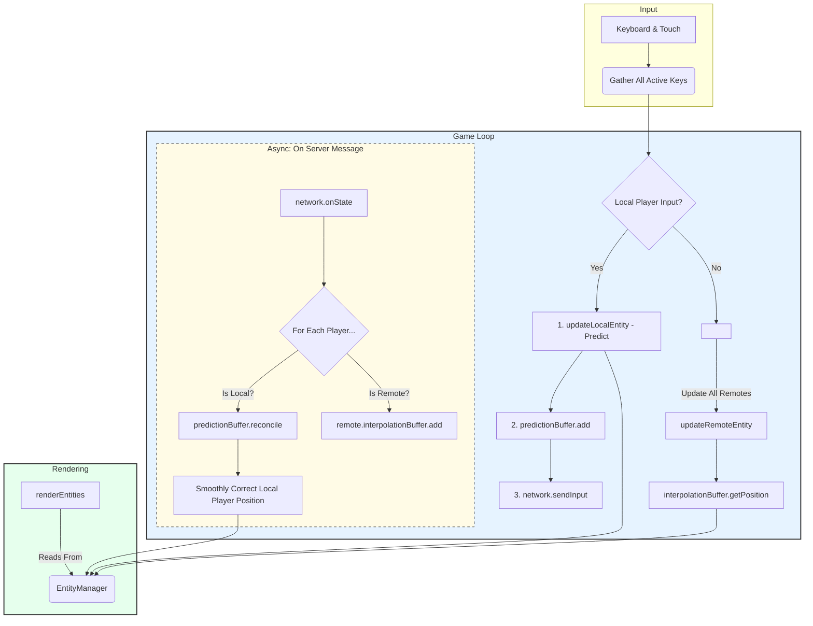

# Client Data Structures and Schema

This document outlines the core data structures used by the client application in `main.tsx` to manage local state, render the world, and synchronize with the server.

The client architecture is designed to make the game *feel* responsive, even with network latency, by using a combination of prediction, reconciliation, and interpolation.

---

### Core Data Structures

1.  **`entityManager: EntityManager`**: This is the client's local representation of the world. It holds all known entities (both local and remote).
    *   **`entities: Map<string, AnyEntity>`**: Inside the manager, this maps a `playerId` (provided by the server) to its corresponding `LocalEntity` or `RemoteEntity` object. This is the source of truth for the rendering engine.

2.  **`network: NetworkClient`**: This class abstracts all WebSocket communication. It is responsible for connecting to the server, sending client inputs, and receiving server state updates through a clean callback interface (`onInit`, `onState`).

3.  **`predictionBuffer: PredictionBuffer`**: This is a crucial component for the **local player only**.
    *   It stores a queue of `InputFrame` objects, where each frame contains the input keys, delta time, and the sequence number sent to the server.
    *   When the server sends a state correction, this buffer is responsible for re-playing all unacknowledged inputs on top of the server's authoritative state to calculate the *correct* current position, enabling smooth error correction.

4.  **`interpolationBuffer: InterpolationBuffer`**: This buffer exists on **each `RemoteEntity` only**.
    *   It stores a short history of timestamped position snapshots received from the server.
    *   Its purpose is to provide a smoothly interpolated position between two server updates, so remote players appear to glide across the screen instead of snapping every time a packet arrives.

---

### Client-Side Game Loop Data Flow

The following flowchart illustrates the complete client-side process for a single frame, showing how local and remote players are handled differently to create a polished experience.

