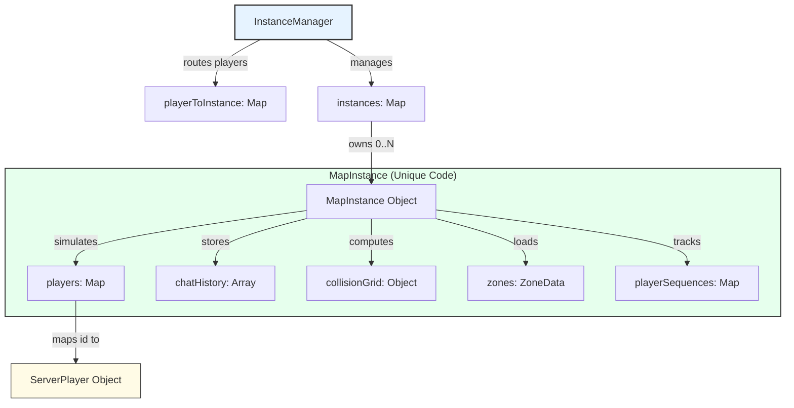

# Server Data Structures and Schema (Phase 5 - Multi-Instance Architecture)

This document outlines the core data structures used by the multiplayer backend in `server/main.ts` to manage multiple parallel space instances, coordinate real-time movements, resolve collisions, and enforce chat routing.

In Phase 5, the server was refactored from a single-map lobby into a scalable **Multi-Instance architecture** orchestrated by the `InstanceManager` and powered by individual `MapInstance` workspaces.

---

### Core Components



---

### 1. `InstanceManager`
This is the top-level orchestrator of the server. It manages instance life cycles, generates lobby codes, and routes incoming WebSocket messages to the correct instances.

*   **`instances: Map<string, MapInstance>`**: Maps a 6-character, uppercase lobby code (e.g., `ABC123`) to its active `MapInstance` workspace.
*   **`playerToInstance: Map<string, string>`**: Maps a connected `playerId` to the lobby code of the space they are currently occupying. This enables constant-time ($O(1)$) instance routing.

---

### 2. `MapInstance`
An isolated virtual space running its own authoritative simulation, chat routing, and collision detection.

*   **`code: string`**: The 6-character uppercase lobby code identifying this instance.
*   **`players: Map<string, ServerPlayer>`**: Maps a player's ID to their active `ServerPlayer` object.
*   **`playerSequences: Map<string, number>`**: Maps a `playerId` to the last acknowledged client input sequence number ($S$). Sent back to the client in `msg.local.sequence` to acknowledge prediction steps.
*   **`zones: ZoneData[]`**: Array of geometric room dimensions loaded dynamically from `final_map.tmj` (via `ZoneLoader.ts`).
*   **`collisionGrid`**: A solid/empty grid array representation of the collision layer used for server-side bounding box movement validation:
    *   `width`: Grid width in tiles.
    *   `height`: Grid height in tiles.
    *   `tileSize`: Dimensions of a tile (e.g., `16`).
    *   `grid: boolean[][]`: 2D array indicating whether a coordinate `[y][x]` is solid (impassable).
*   **`chatHistory: ChatMessage[]`**: Stores a historical sliding buffer of the last 50 persistent chat messages (global and room-scoped chats).

---

### 3. `ServerPlayer`
Keeps track of an individual client's state, socket connection, and spatial coordinates inside a `MapInstance`.

```typescript
interface ServerPlayer {
  id: string;          // Unique generated string (e.g. "p-abc1234")
  ws: WebSocket;       // Active network connection to client
  x: number;           // Authoritative world X coordinate
  y: number;           // Authoritative world Y coordinate
  lastInput: number;   // Timestamp (Date.now()) of last processed packet
  status: 'online' | 'away'; // Status for AFK checking
  room: string | null; // Current bounding zone/room name (e.g. "arcade")
  name: string;        // Client's display name
}
```

---

### Key Data Flows

#### 1. Real-Time Authoritative Movement & Collisions
When the client sends an `{ type: 'input' }` packet, the server updates their position authoritatively:
*   The server moves the player using the client's actual delta-time (`dt`) and the shared base speed of `96` pixels/sec.
*   The server performs a **12x12 Pixel 4-Corner AABB bounding box collision check** against the `collisionGrid` matching the client's local physics checks exactly.
*   If clear, the coordinate is accepted. The player's room is dynamically re-calculated based on their new coordinate using `getPlayerRoom(x, y, zones)`.

#### 2. Chat Filtering and Recipient Scoping
When a player broadcasts a chat message, recipients are filtered in $O(N)$ based on the selected `mode`:
*   **`global`**: Sent to all players currently in the same `MapInstance`.
*   **`room`**: Sent only to players whose `player.room` matches the sender's current room.
*   **`nearby`**: Sent to players within a **200-pixel radial distance** of the sender:
    $$\sqrt{(x_{\text{recipient}} - x_{\text{sender}})^2 + (y_{\text{recipient}} - y_{\text{sender}})^2} \le 200$$

#### 3. State Replication Loop
Every 50ms (20Hz `TICK_RATE`), the server runs a broadcast tick:
1. Iterates over all active instances in `InstanceManager`.
2. For each instance, computes state packages for all participants.
3. Packages include other players' positions (`msg.players`), and a custom `local` block matching the participant's own sequence number (`msg.local.sequence`) to drive client prediction and reconciliation.
