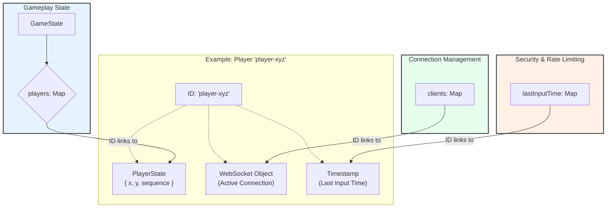

# Server Data Structures and Schema

This document outlines the core data structures used by the multiplayer server in `server/main.ts` to manage game state, client connections, and security.

The entire server state is built around three core `Map` objects, all of which use a unique `playerId` string as their primary key.

---

### Core Data Structures

1.  **`state: GameState`**: This is the single source of truth for all gameplay-related information.
    *   **`players: Map<string, PlayerState>`**: The heart of the game state. It maps a `playerId` to a `PlayerState` object, which contains the player's authoritative position and the sequence number of the last input processed from them.

2.  **`clients: Map<string, WebSocket>`**: This map manages the active network connections.
    *   It maps a `playerId` to the corresponding `WebSocket` object for that client. This allows the server to send messages to a specific player or to iterate over all connections to broadcast a message.

3.  **`lastInputTime: Map<string, number>`**: This map is used for security and server stability.
    *   It maps a `playerId` to the `Date.now()` timestamp of their last received input. This is used to enforce rate limiting and prevent a single client from overwhelming the server with too many messages.

### The `playerId` as a Primary Key

A unique `playerId` string (e.g., `player-a1b2c3d4`) is generated for every new connection. This ID is the critical link that ties all three data structures together. For any given player:

*   `state.players.get(playerId)` returns their position.
*   `clients.get(playerId)` returns their WebSocket connection.
*   `lastInputTime.get(playerId)` returns their last activity timestamp.

When a player disconnects, their `playerId` is used to remove their associated data from all three maps, ensuring a clean state with no memory leaks.

---

### Data Flow and Schema Diagram

The following flowchart illustrates how a single `playerId` connects the different state maps on the server.

